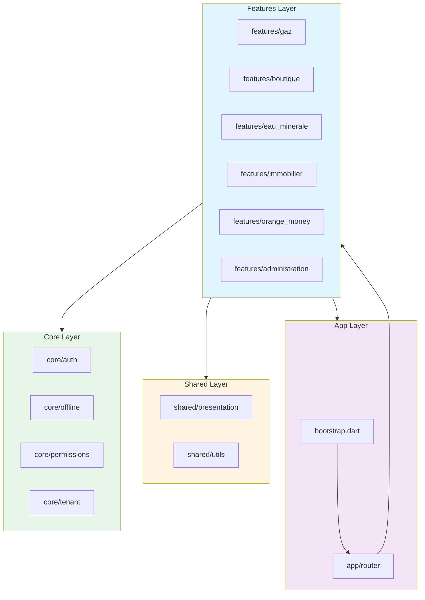
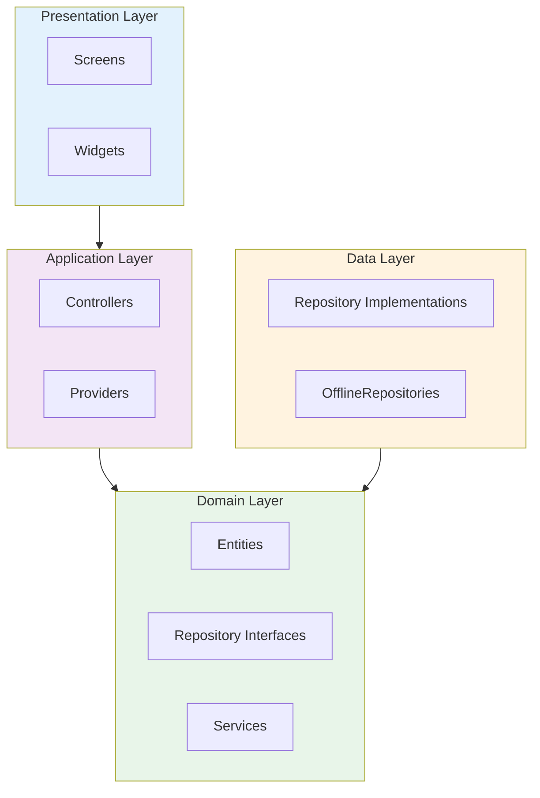
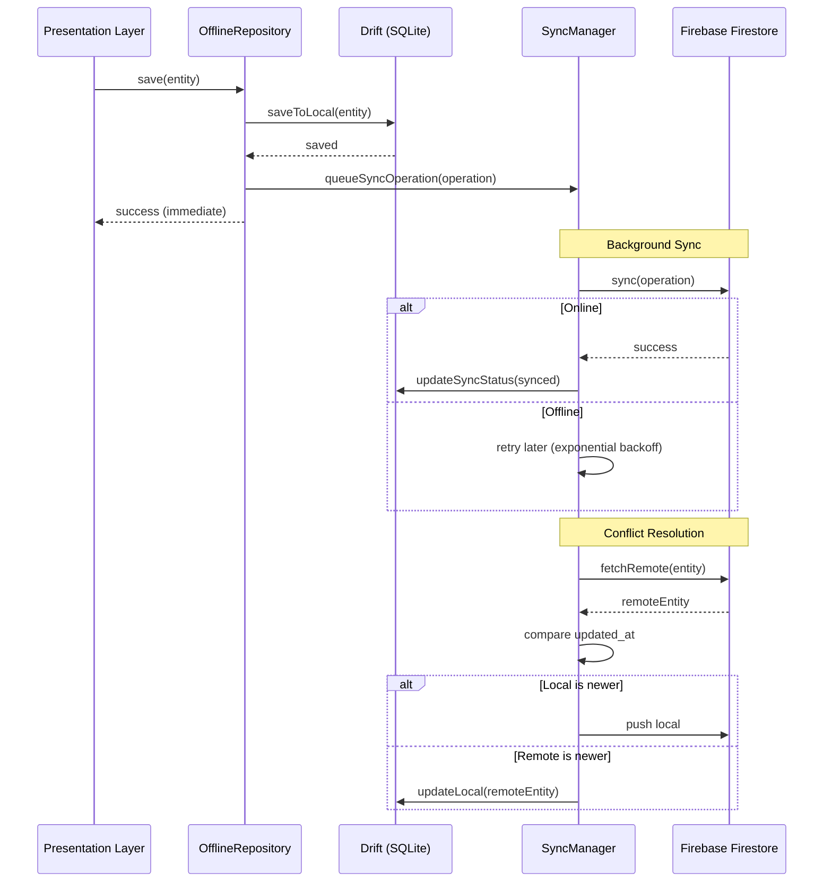
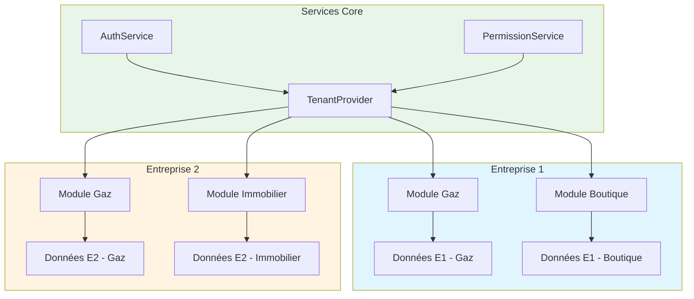

# Architecture du Projet ELYF Group App

## Vue d'Ensemble



## Structure du Projet

### Organisation par Features

Le projet utilise une organisation par **features** (fonctionnalités) plutôt que par modules techniques. Cette approche améliore la maintenabilité et la scalabilité.

```
lib/
├── features/          # Modules organisés par fonctionnalité
│   ├── boutique/      # Module boutique
│   ├── eau_minerale/  # Module eau minérale
│   ├── gaz/           # Module gaz
│   ├── orange_money/  # Module Orange Money
│   ├── immobilier/    # Module immobilier
│   └── administration/# Module administration
├── shared/            # Composants partagés
│   ├── presentation/  # Widgets UI partagés
│   └── utils/         # Utilitaires partagés
├── core/              # Services transverses
│   ├── auth/          # Authentification
│   ├── offline/       # Infrastructure offline-first
│   ├── permissions/   # Gestion des permissions
│   └── tenant/        # Gestion multi-tenant
└── app/               # Configuration application
    ├── router/        # Configuration routing
    └── bootstrap.dart # Initialisation
```

### Note sur "features" vs "modules"

**Règle originale** : Le projet devait utiliser `lib/modules/`  
**Réalité** : Le projet utilise `lib/features/`

**Justification** : `features/` est une meilleure pratique moderne qui :
- Organise le code par fonctionnalité métier
- Facilite la navigation et la maintenance
- Améliore la scalabilité
- Suit les recommandations Flutter/Dart modernes

Cette différence est documentée ici pour éviter toute confusion.

## Architecture par Couches

Chaque feature suit une architecture en couches (Clean Architecture) :

```
feature/
├── presentation/      # UI (widgets, screens)
│   ├── screens/      # Écrans principaux
│   └── widgets/       # Widgets spécifiques au module
├── application/       # State management (Riverpod)
│   ├── controllers/   # Controllers métier
│   └── providers.dart # Providers Riverpod
├── domain/           # Logique métier
│   ├── entities/     # Entités métier
│   ├── repositories/ # Interfaces de repositories
│   └── services/     # Services métier
└── data/             # Implémentations
    └── repositories/ # Repositories (Mock ou Offline)
```

### Diagramme des Couches



### Règles de Dépendances entre Couches

1. **Presentation** → **Application** : Les widgets utilisent les providers/controllers
2. **Application** → **Domain** : Les controllers utilisent les services et interfaces de repository
3. **Data** → **Domain** : Les implémentations de repository implémentent les interfaces du domain
4. **Domain** est indépendant : Ne dépend ni de Presentation ni de Data
5. **Interdictions** :
   - ❌ Presentation → Data (doit passer par Application et Domain)
   - ❌ Domain → Presentation ou Data
   - ❌ Data → Presentation ou Application

## Offline-First Architecture

### Principe

L'application fonctionne en mode **offline-first** :
1. **Écriture locale d'abord** : Toutes les opérations sont d'abord persistées localement
2. **Synchronisation en arrière-plan** : Les opérations sont synchronisées avec Firestore quand en ligne
3. **Résolution de conflits** : Utilise `updated_at` pour résoudre les conflits (last write wins)

### Diagramme de Flux de Données Offline-First



### Composants

- **DriftService** : Base de données locale Drift (SQLite)
- **AppDatabase / OfflineRecordDao** : Stockage générique `OfflineRecords` (JSON) + CRUD
- **SyncManager** : Gestionnaire de synchronisation
- **ConnectivityService** : Surveillance de la connectivité
- **OfflineRepository<T>** : Classe de base pour repositories offline-first
- **FirebaseSyncHandler** : Handler de synchronisation Firestore

### Stockage local (Drift)

Les entités sont stockées dans une table SQLite unique `OfflineRecords` :
- `collectionName` (ex: `products`, `sales`)
- `enterpriseId`, `moduleType` (multi-tenant)
- `localId`, `remoteId` (liaison Firestore)
- `dataJson` (payload JSON complet)
- `localUpdatedAt` (tri & conflits)

## Multi-Tenant Architecture

### Principe

L'application supporte plusieurs entreprises (multi-tenant) :
- Chaque entreprise a ses propres données
- Isolation des données par `enterpriseId`
- Support de plusieurs modules par entreprise

### Diagramme Multi-Tenant



### Implémentation

- **Enterprise** : Entité représentant une entreprise
- **ActiveEnterpriseProvider** : Provider pour l'entreprise active
- **Filtrage** : Tous les repositories filtrent par `enterpriseId`
- **ModuleId** : Identifie le module actif (boutique, gaz, etc.)

## State Management

### Riverpod

Le projet utilise **Riverpod** pour la gestion d'état :
- **Providers** : Définis dans `application/providers.dart`
- **Controllers** : Logique métier orchestrée par des controllers
- **AsyncValue** : Gestion des états asynchrones (loading, data, error)

### Diagramme de Flux State Management

```mermaid
graph LR
    subgraph UI["UI Layer"]
        Widget[Widget]
    end
    
    subgraph Riverpod["Riverpod"]
        Provider[Provider]
        Controller[Controller/StateNotifier]
    end
    
    subgraph Domain["Domain Layer"]
        Service[Service]
        Repository[Repository Interface]
    end
    
    subgraph Data["Data Layer"]
        RepoImpl[Repository Implementation]
    Drift[Drift (SQLite)]
    end
    
    Widget -->|watch| Provider
    Provider -->|uses| Controller
    Controller -->|calls| Service
    Service -->|uses| Repository
    Repository -->|implemented by| RepoImpl
RepoImpl -->|reads/writes| Drift
    
    style UI fill:#e3f2fd
    style Riverpod fill:#f3e5f5
    style Domain fill:#e8f5e9
    style Data fill:#fff3e0
```

### Patterns

1. **Repository Pattern** : Abstraction des sources de données
2. **Service Pattern** : Logique métier dans des services
3. **Controller Pattern** : Orchestration des opérations métier

## Séparation des Responsabilités

### Règle : Pas de Logique Métier dans l'UI

**❌ Mauvais** :
```dart
Widget build(BuildContext context) {
  final total = sales.fold(0, (sum, s) => sum + s.totalPrice);
  // ...
}
```

**✅ Bon** :
```dart
// Dans un service
class DashboardCalculationService {
  int calculateTotalRevenue(List<Sale> sales) {
    return sales.fold(0, (sum, s) => sum + s.totalPrice);
  }
}

// Dans le widget
Widget build(BuildContext context) {
  final total = ref.watch(dashboardCalculationServiceProvider)
      .calculateTotalRevenue(sales);
  // ...
}
```

### Services de Calcul

Services créés pour extraire la logique métier :
- `DashboardCalculationService` : Calculs de dashboard
- `ReportCalculationService` : Calculs de rapports
- `SaleService` : Logique de vente
- `ProductionService` : Logique de production
- `ProductCalculationService` : Calculs de produits

## Gestion d'Erreurs

### ErrorHandler

Système centralisé de gestion d'erreurs :
- `ErrorHandler` : Gestionnaire centralisé
- `AppException` : Exceptions de base
- Types d'erreurs : `NetworkException`, `ValidationException`, etc.

### Utilisation

```dart
try {
  // ...
} catch (error, stackTrace) {
  final appException = ErrorHandler.instance.handleError(error, stackTrace);
  // Afficher l'erreur à l'utilisateur
}
```

## Sécurité

### Authentification

- `AuthService` : Service d'authentification
- `AuthGuard` : Protection des routes
- `SecureStorageService` : Stockage sécurisé des données sensibles

### Permissions

- `PermissionService` : Gestion centralisée des permissions
- Permissions par module et par rôle
- Isolation multi-tenant

## Composants Réutilisables

### Widgets Partagés

- `FormDialog` : Dialog générique pour formulaires
- `ExpenseFormDialog` : Dialog générique pour dépenses
- `BaseModuleShellScreen` : Écran shell de base pour modules
- `AdaptiveNavigationScaffold` : Scaffold adaptatif
- `AuthGuard` : Protection des routes
- `EnterpriseSelectorWidget` : Sélecteur d'entreprise
- `SyncStatusIndicator` : Indicateur de statut de synchronisation

### Champs de Formulaire

- `CustomerFormFields` : Champs de formulaire client
- `AmountInputField` : Champ de saisie de montant
- `DatePickerField` : Champ de sélection de date
- `CategorySelectorField` : Sélecteur de catégorie

### Validators

- `required` : Validation requise
- `phone` : Validation téléphone
- `amount` : Validation montant
- `email` : Validation email

## Bonnes Pratiques

### Taille des Fichiers

- **Objectif** : < 200 lignes par fichier
- **Maximum** : 500 lignes (à éviter)
- **Critique** : > 1000 lignes (à découper immédiatement)

### Découpage

- Extraire les sections complexes en widgets séparés
- Extraire la logique métier vers des services
- Utiliser des widgets privés au lieu de méthodes helper

### Imports

- Éviter les imports très profonds (4+ niveaux de `../`)
- Utiliser des imports absolus quand possible
- Organiser les imports : dart, package, relative

### Tests

- Tests unitaires pour la logique métier
- Tests d'intégration pour la synchronisation
- Tests widget pour les composants critiques

## Dépendances entre Modules

### Règles d'Isolation

Les modules (features) sont conçus pour être **complètement indépendants** :

1. **Aucune dépendance directe entre features** :
   - ❌ `features/gaz/` ne peut pas importer depuis `features/boutique/`
   - ❌ `features/eau_minerale/` ne peut pas importer depuis `features/immobilier/`
   - ✅ Chaque feature est isolée et peut être développée/testée indépendamment

2. **Dépendances autorisées** :
   - ✅ `features/*` → `shared/` (composants UI partagés, utilitaires)
   - ✅ `features/*` → `core/` (services transverses : auth, offline, permissions, tenant)
   - ✅ `features/*` → `app/` (configuration, routing)

3. **Communication entre modules** :
   - Via `shared/` : Composants UI réutilisables (FormDialog, ExpenseFormDialog, etc.)
   - Via `core/` : Services partagés (AuthService, PermissionService, DriftService, etc.)
   - Via `app/router/` : Navigation entre modules

### Diagramme de Dépendances

```mermaid
graph TD
    subgraph Features["Features (Modules Indépendants)"]
        Gaz[features/gaz]
        Boutique[features/boutique]
        EauMinerale[features/eau_minerale]
        Immobilier[features/immobilier]
        OrangeMoney[features/orange_money]
        Administration[features/administration]
    end
    
    subgraph Shared["Shared (Composants Partagés)"]
        SharedWidgets[shared/presentation/widgets]
        SharedUtils[shared/utils]
    end
    
    subgraph Core["Core (Services Transverses)"]
        Auth[core/auth]
        Offline[core/offline]
        Permissions[core/permissions]
        Tenant[core/tenant]
    end
    
    subgraph App["App (Configuration)"]
        Router[app/router]
        Bootstrap[app/bootstrap]
    end
    
    Gaz --> SharedWidgets
    Gaz --> SharedUtils
    Gaz --> Auth
    Gaz --> Offline
    Gaz --> Permissions
    Gaz --> Tenant
    Gaz --> Router
    
    Boutique --> SharedWidgets
    Boutique --> SharedUtils
    Boutique --> Auth
    Boutique --> Offline
    Boutique --> Permissions
    Boutique --> Tenant
    Boutique --> Router
    
    EauMinerale --> SharedWidgets
    EauMinerale --> SharedUtils
    EauMinerale --> Auth
    EauMinerale --> Offline
    EauMinerale --> Permissions
    EauMinerale --> Tenant
    EauMinerale --> Router
    
    Immobilier --> SharedWidgets
    Immobilier --> SharedUtils
    Immobilier --> Auth
    Immobilier --> Offline
    Immobilier --> Permissions
    Immobilier --> Tenant
    Immobilier --> Router
    
    OrangeMoney --> SharedWidgets
    OrangeMoney --> SharedUtils
    OrangeMoney --> Auth
    OrangeMoney --> Offline
    OrangeMoney --> Permissions
    OrangeMoney --> Tenant
    OrangeMoney --> Router
    
    Administration --> SharedWidgets
    Administration --> SharedUtils
    Administration --> Auth
    Administration --> Offline
    Administration --> Permissions
    Administration --> Tenant
    Administration --> Router
    
    style Features fill:#e1f5ff
    style Shared fill:#fff4e1
    style Core fill:#e8f5e9
    style App fill:#f3e5f5
```



### Services Partagés

Services partagés dans `core/` utilisés par tous les modules :

- **`AuthService`** : Authentification et gestion de session
- **`PermissionService`** : Gestion centralisée des permissions par module
- **`DriftService`** : Base de données locale Drift (SQLite)
- **`SyncManager`** : Synchronisation avec Firestore
- **`ConnectivityService`** : Surveillance de la connectivité réseau
- **`TenantProvider`** : Gestion multi-tenant (entreprise active)

### Vérification des Dépendances

Pour vérifier qu'aucune dépendance croisée n'existe entre features :

```bash
# Rechercher les imports interdits
grep -r "import.*features/" lib/features/*/ --exclude-dir=node_modules
```

**Résultat attendu** : Aucun import direct entre features (seulement via `shared/` ou `core/`)

## Vérification de l'Architecture

### Tests d'Architecture avec dependency_validator

Le projet utilise `dependency_validator` pour vérifier automatiquement que les règles d'architecture sont respectées.

#### Configuration

Le fichier `dependency_validator.yaml` définit :
- **Dépendances interdites** : Features ne peuvent pas s'importer entre elles, règles de couches
- **Dépendances autorisées** : Features → shared/core/app, Application → Domain, etc.

#### Utilisation

```bash
# Vérifier l'architecture
dart run dependency_validator

# Ou utiliser le script
dart scripts/check_architecture.dart
```

#### Règles Vérifiées

1. **Isolation des Features** : Aucune dépendance directe entre features
2. **Séparation des Couches** :
   - Presentation ne peut pas importer Data
   - Domain ne peut pas importer Presentation ou Data
   - Data ne peut pas importer Presentation ou Application
3. **Dépendances Autorisées** :
   - Features → shared/core/app ✅
   - Application → Domain ✅
   - Presentation → Application ✅
   - Data → Domain ✅

## Évolution Future

### Améliorations Planifiées

1. **Migration complète vers OfflineRepositories** : Remplacer tous les MockRepositories
2. **Tests** : Ajouter des tests unitaires et d'intégration
3. **Documentation** : Améliorer la documentation des APIs
4. **Performance** : Optimiser les requêtes locales (Drift/SQLite)
5. **Sécurité** : Migration vers Firebase Auth

