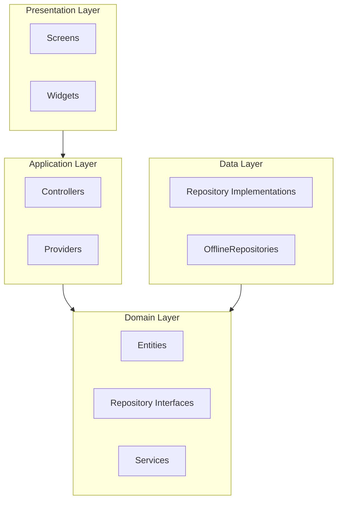

# Architecture par Couches

Chaque feature suit une architecture en couches (Clean Architecture) :

```
feature/
├── presentation/      # UI (widgets, screens)
│   ├── screens/      # Écrans principaux
│   └── widgets/       # Widgets spécifiques au module
├── application/       # State management (Riverpod)
│   ├── controllers/   # Controllers métier
│   └── providers.dart # Providers Riverpod
├── domain/           # Logique métier
│   ├── entities/     # Entités métier
│   ├── repositories/ # Interfaces de repositories
│   └── services/     # Services métier
└── data/             # Implémentations
    └── repositories/ # Repositories (Mock ou Offline)
```

## Diagramme des Couches



## Règles de Dépendances entre Couches

1. **Presentation** → **Application** : Les widgets utilisent les providers/controllers
2. **Application** → **Domain** : Les controllers utilisent les services et interfaces de repository
3. **Data** → **Domain** : Les implémentations de repository implémentent les interfaces du domain
4. **Domain** est indépendant : Ne dépend ni de Presentation ni de Data
5. **Interdictions** :
   - ❌ Presentation → Data (doit passer par Application et Domain)
   - ❌ Domain → Presentation ou Data
   - ❌ Data → Presentation ou Application
