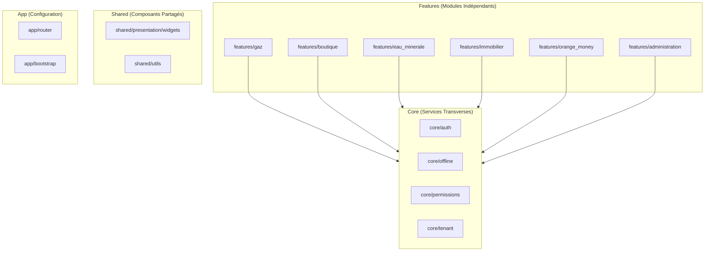

# Dépendances entre Modules

## Règles d'Isolation

Les modules (features) sont conçus pour être **complètement indépendants** :

1. **Aucune dépendance directe entre features** :
   - ❌ `features/gaz/` ne peut pas importer depuis `features/boutique/`
   - ❌ `features/eau_minerale/` ne peut pas importer depuis `features/immobilier/`
   - ✅ Chaque feature est isolée et peut être développée/testée indépendamment

2. **Dépendances autorisées** :
   - ✅ `features/*` → `shared/` (composants UI partagés, utilitaires)
   - ✅ `features/*` → `core/` (services transverses : auth, offline, permissions, tenant)
   - ✅ `features/*` → `app/` (configuration, routing)

3. **Communication entre modules** :
   - Via `shared/` : Composants UI réutilisables
   - Via `core/` : Services partagés
   - Via `app/router/` : Navigation entre modules

## Diagramme de Dépendances

## Services Partagés

Services partagés dans `core/` utilisés par tous les modules :
- **`AuthService`** : Authentification et gestion de session
- **`PermissionService`** : Gestion centralisée des permissions par module
- **`DriftService`** : Base de données locale Drift (SQLite)
- **`SyncManager`** : Synchronisation avec Firestore
- **`ConnectivityService`** : Surveillance de la connectivité réseau
- **`TenantProvider`** : Gestion multi-tenant (entreprise active)
