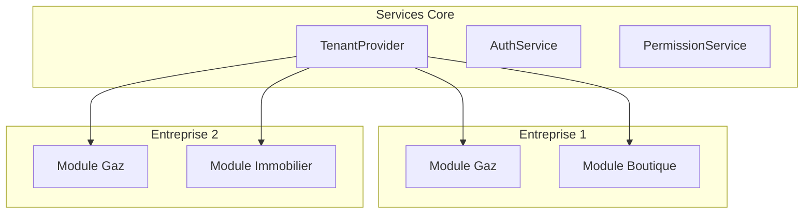

# Multi-Tenant Architecture

## Principe

L'application supporte plusieurs entreprises (multi-tenant) :
- Chaque entreprise a ses propres données
- Isolation des données par `enterpriseId`
- Support de plusieurs modules par entreprise

## Diagramme Multi-Tenant

## Implémentation

- **Enterprise** : Entité représentant une entreprise
- **ActiveEnterpriseProvider** : Provider pour l'entreprise active
- **Filtrage** : Tous les repositories filtrent par `enterpriseId`
- **ModuleId** : Identifie le module actif (boutique, gaz, etc.)
