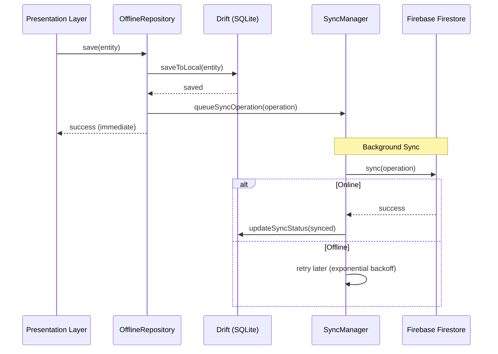

# Offline-First Architecture

## Principe

L'application fonctionne en mode **offline-first** :
1. **Écriture locale d'abord** : Toutes les opérations sont d'abord persistées localement
2. **Synchronisation en arrière-plan** : Les opérations sont synchronisées avec Firestore quand en ligne
3. **Résolution de conflits** : Utilise `updated_at` pour résoudre les conflits (last write wins)

## Diagramme de Flux de Données Offline-First

## Composants

- **DriftService** : Base de données locale Drift (SQLite)
- **AppDatabase / OfflineRecordDao** : Stockage générique `OfflineRecords` (JSON) + CRUD
- **SyncManager** : Gestionnaire de synchronisation
- **ConnectivityService** : Surveillance de la connectivité
- **OfflineRepository<T>** : Classe de base pour repositories offline-first
- **FirebaseSyncHandler** : Handler de synchronisation Firestore

## Stockage local (Drift)

Les entités sont stockées dans une table SQLite unique `OfflineRecords` :
- `collectionName` (ex: `products`, `sales`)
- `enterpriseId`, `moduleType` (multi-tenant)
- `localId`, `remoteId` (liaison Firestore)
- `dataJson` (payload JSON complet)
- `localUpdatedAt` (tri & conflits)
