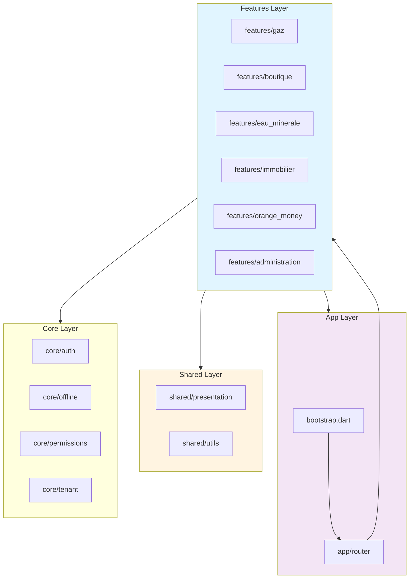

# Vue d'Ensemble

```mermaid
graph TB
    subgraph AppLayer["App Layer"]
        Bootstrap[bootstrap.dart]
        Router[app/router]
    end
    
    subgraph FeaturesLayer["Features Layer"]
        Gaz[features/gaz]
        Boutique[features/boutique]
        EauMinerale[features/eau_minerale]
        Immobilier[features/immobilier]
        OrangeMoney[features/orange_money]
        Administration[features/administration]
    end
    
    subgraph SharedLayer["Shared Layer"]
        SharedWidgets[shared/presentation]
        SharedUtils[shared/utils]
    end
    
    subgraph CoreLayer["Core Layer"]
        Auth[core/auth]
        Offline[core/offline]
        Permissions[core/permissions]
        Tenant[core/tenant]
    end
    
    Bootstrap --> Router
    Router --> FeaturesLayer
    FeaturesLayer --> SharedLayer
    FeaturesLayer --> CoreLayer
    FeaturesLayer --> AppLayer
    
    style AppLayer fill:#f3e5f5
    style FeaturesLayer fill:#e1f5ff
    style SharedLayer fill:#fff4e1
    style CoreLayer fill:#e8f5e green
```
